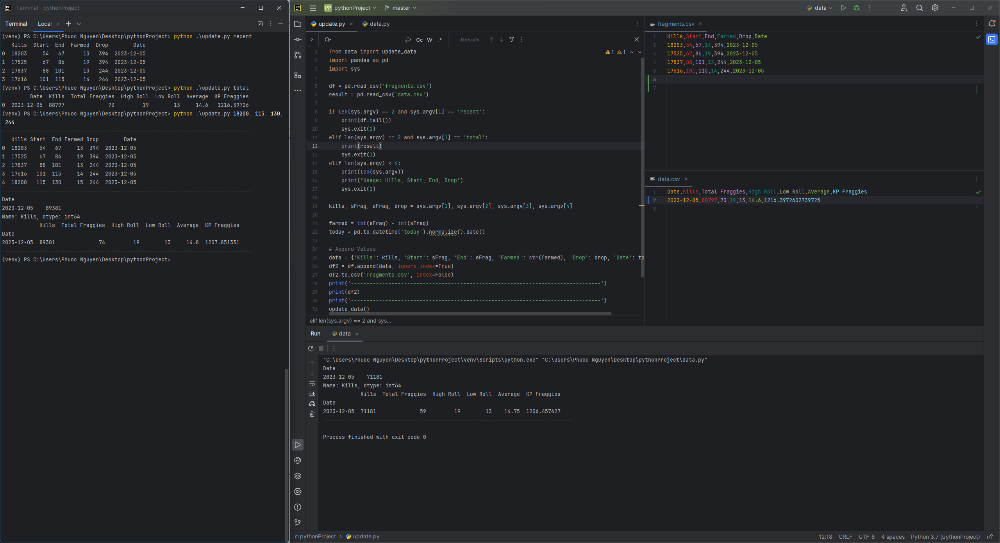

# MapleStory-Fragment-Tracker

Usage: 
In Command Line: 
* ```python .\update.py <Kills>, <Starting Fragment>, <Ending Fragment>, <Drop>```
  * Track how much you farmed within the hour. This will be stored in fragments.csv and an updated data.csv will be produced
* ```python .\update.py recent```
  * Displays the most recent 10 (maybe 5) changes to fragments.csv
* ```python .\update.py total```
  * Displays day by day your rates and averages


